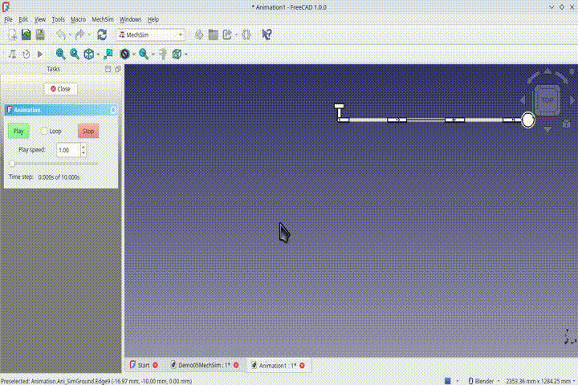

# <em><b>MechSim</em>
# <h2>A Mechanical Simulator Workbench for FreeCAD 1.x</h2>
# <h3>Calculation and Simulation of the Dynamics of Planar Multibody Mechanical Systems</h3>

# <h3>[Previously "NikraDAP" for FreeCAD 0.x]</h3>

The <strong>MechSim</strong> FreeCAD WorkBench is a planar multibody dynamics workbench that is based on the DAP solver algorithm developed by P.E.&nbsp;Nikravesh (**PLANAR MULTIBODY DYNAMICS: Formulation, Programming with MATLAB, and Applications**, 2nd Edition, *P.E.&nbsp;Nikravesh*, CRC&nbsp;Press, 2018)  
  

# There are draft tutorials available for <em>MechSim</em> on YouTube:

<strong>https://github.com/@CecilChurmsBrightSparks</strong> 

  

<strong><em>Please be patient.  The software and documentation is not yet mature, and is still in the process of development.</em></strong>

# ---------------------------------------

Cecil Churms, 
Johannesburg, 
South Africa.  

Last updated: 28th April 2025 

